# Count Together

### Put your observation skills to the test in this competitive counting game for up to 8 players!


# How to Play
The game will be available on AirConsole. Select *Count Together* on the website. To play, go to www.airconsole.com or download the AirConsole app on your phone and enter the code shown on screen. Once everyone is in, the host can start the game. Each round will show you what critter to count before they dash across the screen. Tap anywhere on your phone to count how many you see! The closer the guess, the higher the score.

> The assets made for *Count Together*
> were made in virtual reality using Quill
> art software. Scripts were written in
> C# through Visual Studio and the game
> was made in the Unity Engine.

### Critters

Get to know the cast:

| Critter | Photo |
| ------ | ------ |
| Batte | 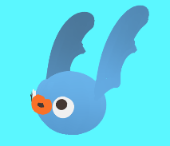 |
| Birdple | 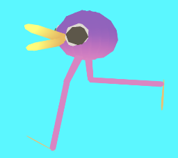 | 
| Bluebey | 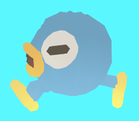 |
| Cherb | 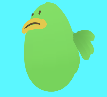 |
| Doog |  |
| Fisk | 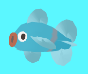 |
| Ghost | 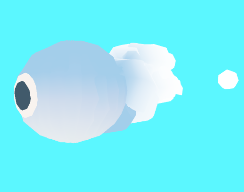 |
| Greengo | 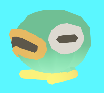 |
| Greenon | 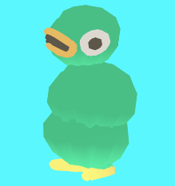 |
| Gruub | 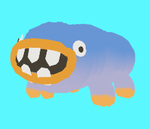 |
| Purble | 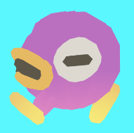 |
| Roborg | 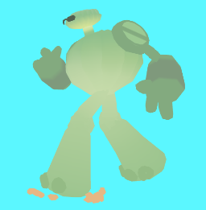 | 

# Pictures


# Todos
```sh
Assess >3 player issue (potentially involving device_ids)
Add char limit to name text fields
Fully pause game when showAd called
```

# Credits
- Nathan Ladd - Programming
- Nick Ladd - Art and Assets
- Wataru Kanzaki - UnityQuillFBXAnim
- Kevin MacLeod - "Street Party" (incompetech.com)
Licensed under Creative Commons: By Attribution 3.0 License
http://creativecommons.org/licenses/by/3.0/
- Made possible by Unity and AirConsole
